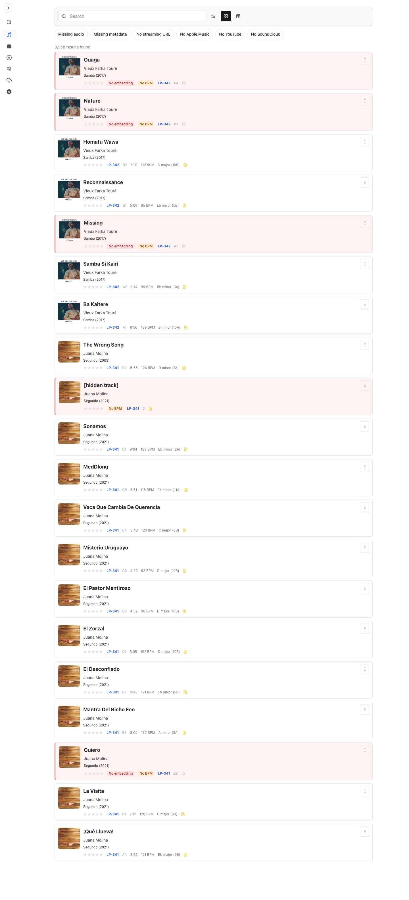
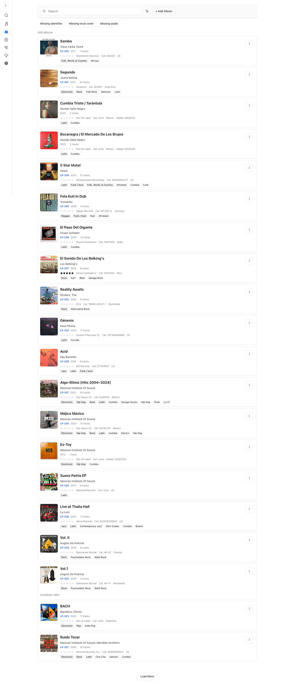
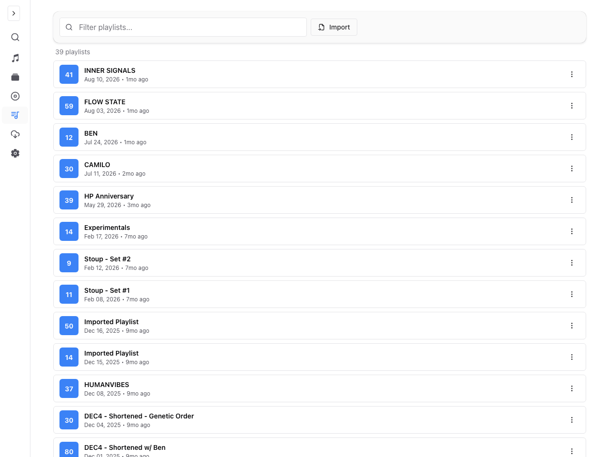
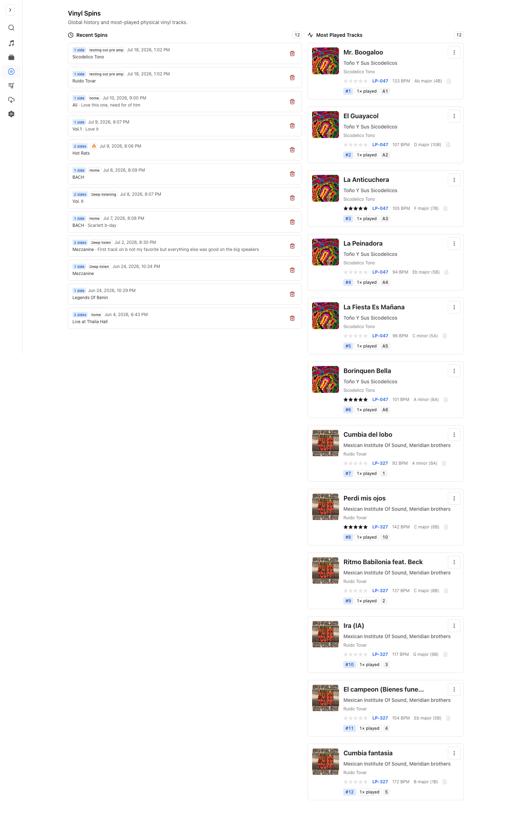

<p align="center">
  
</p>

<h1 align="center">GrooveNet</h1>

<p align="center">A self-hosted vinyl collection manager for DJs.</p>

<p align="center">
  <a href="https://github.com/Public-Vinyl-Radio/groovenet/releases"></a>
  <a href="LICENSE"></a>
  <a href="https://github.com/Public-Vinyl-Radio/groovenet/commits/main"></a>
  <a href="https://codecov.io/gh/Public-Vinyl-Radio/groovenet" ></a>
  <a href="https://github.com/Public-Vinyl-Radio/groovenet/actions/workflows/test.yml"></a>
</p>

GrooveNet imports your Discogs collection, enriches it with streaming metadata, analyzes audio for BPM, key, and mood, and helps you build better DJ playlists. Use it in the web or iOS app, from the `groovenet` CLI, or through the MCP server.

## Screenshots

<table>
  <tr>
    <td width="50%"><br /><sub>Collection</sub></td>
    <td width="50%"><br /><sub>Albums</sub></td>
  </tr>
  <tr>
    <td width="50%"><br /><sub>Playlists</sub></td>
    <td width="50%"><br /><sub>Listening history</sub></td>
  </tr>
</table>

## Run GrooveNet

The simplest self-hosted install needs [Docker Compose v2](https://docs.docker.com/compose/).

```bash
git clone https://github.com/Public-Vinyl-Radio/groovenet.git
cd groovenet

cp .env.example .env
# Edit .env: at minimum, set POSTGRES_PASSWORD and your Discogs values.

docker compose -f docker-compose.yml -f docker-compose.local.yml up --build -d
docker compose -f docker-compose.yml -f docker-compose.local.yml run --rm migrate
```

Open [http://localhost:3000](http://localhost:3000), then use **Sync from Discogs** to import your collection. The stack stores its database, audio, exports, backups, and cookies in Docker volumes.

### Required configuration

Set these values in `.env` before starting:

| Variable             | Purpose                                                                                              |
| -------------------- | ---------------------------------------------------------------------------------------------------- |
| `POSTGRES_PASSWORD`  | A strong password for the bundled database                                                           |
| `DISCOGS_USER_TOKEN` | Personal access token from [Discogs developer settings](https://www.discogs.com/settings/developers) |
| `DISCOGS_USERNAME`   | Your Discogs username                                                                                |
| `DISCOGS_FOLDER_ID`  | `0` for your full collection, or a specific folder ID                                                |

Apple Music, YouTube, OpenAI, backup, and analytics settings are optional. See [`.env.example`](.env.example) for the complete list and descriptions.

### Everyday commands

```bash
# Follow service logs
docker compose -f docker-compose.yml -f docker-compose.local.yml logs -f

# Stop the stack; your data remains in Docker volumes
docker compose -f docker-compose.yml -f docker-compose.local.yml down

# Update source, rebuild, and restart
git pull
docker compose -f docker-compose.yml -f docker-compose.local.yml up --build -d
docker compose -f docker-compose.yml -f docker-compose.local.yml run --rm migrate
```

The local override binds the app to `127.0.0.1:3000`. Set `APP_PORT=3001` in `.env` to use another port. Put GrooveNet behind your own reverse proxy to make it available on a network or public domain.

## Features

- **Collection search** — fast full-text and fuzzy search with filtering and infinite scroll.
- **Metadata enrichment** — link Discogs releases to Apple Music, YouTube, and SoundCloud; bulk-edit and complete metadata with AI.
- **Audio intelligence** — analyze downloaded audio with Essentia for BPM, key, and mood.
- **Playlist tools** — generate transitions based on BPM, key, mood, and genre.
- **Collection sharing** — browse friends’ collections and keep a listening history.
- **Automation** — manage the collection through the CLI or MCP server.
- **Data ownership** — self-hosted PostgreSQL, backups, restore, and optional remote storage.

## Clients and integrations

GrooveNet also includes an iOS SwiftUI app for connecting to a self-hosted server. It currently supports server setup, playlist browsing and generation, and local track downloads. See the [iOS app README](ios/DJPlaylistMobile/DJPlaylistMobile/README.md) for Xcode setup and current scope.

Install the CLI from npm:

```bash
npm install -g @groovenet/cli
groovenet config set api_base http://localhost:3000/api
groovenet tracks search "acid house" --bpm-min 120 --bpm-max 135
```

The [CLI README](packages/groovenet-cli/README.md) covers all commands. The [MCP server README](mcp-server/README.md) explains how to connect GrooveNet to an MCP client.

## Development

For contributing or running the hot-reload stack, install [mise](https://mise.jdx.dev/) and [just](https://github.com/casey/just):

```bash
mise install
just bootstrap
just compose-dev
just migrate-up
```

`just bootstrap` installs a git pre-commit hook that runs file hygiene checks,
[ruff](https://docs.astral.sh/ruff/) over the Python services, and ESLint over
the staged web files. The same hooks run in CI, so the hook only moves the
feedback earlier — skip it with `git commit --no-verify` and CI will still
catch it.

Useful checks:

```bash
just test
just lint
just typecheck
just lint-all      # every pre-commit hook, over the whole repo
```

Worktree setup, deployment, releases, and operator-specific overrides are maintainer workflows; see [`AGENTS.md`](AGENTS.md), [`RELEASING.md`](RELEASING.md), and the package-level READMEs when you need them.

## Contributing

Contributions are welcome. Please open an issue to discuss larger changes, keep migrations with schema changes, and run the checks above before opening a pull request. See [the license](LICENSE) for reuse terms.

## License

GrooveNet is released under the [MIT License](LICENSE).
